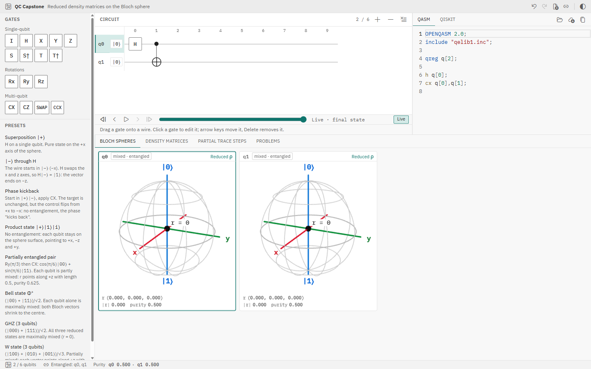
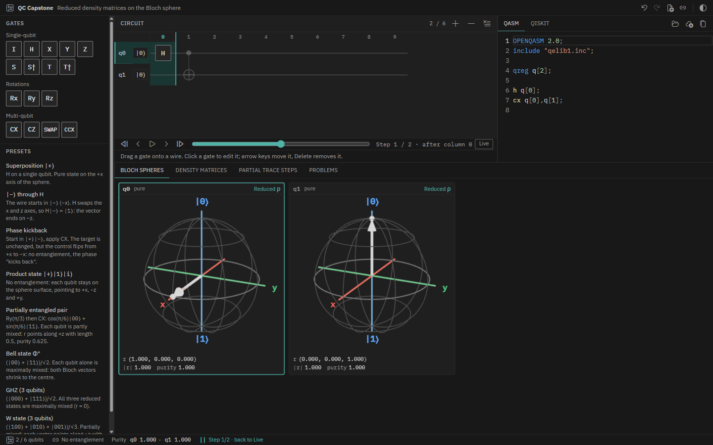
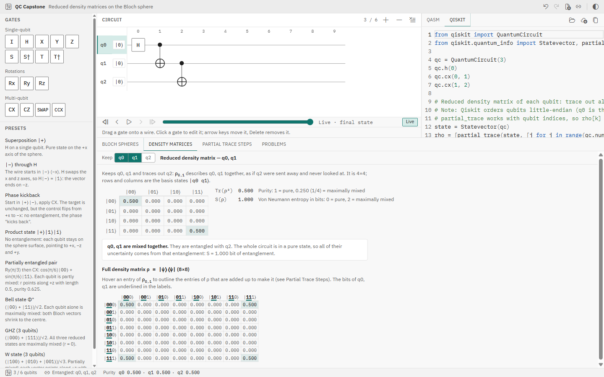
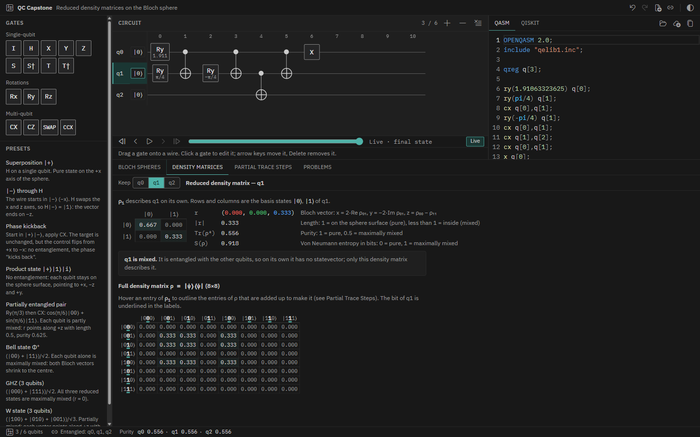
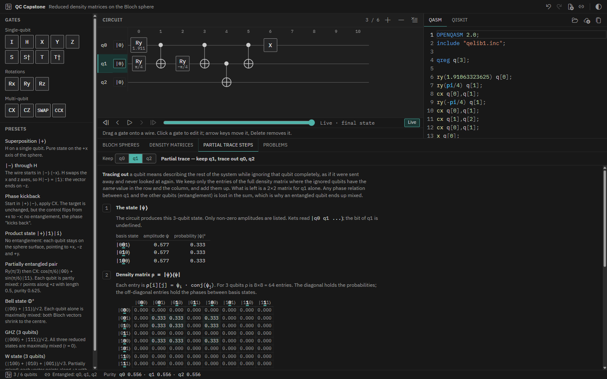
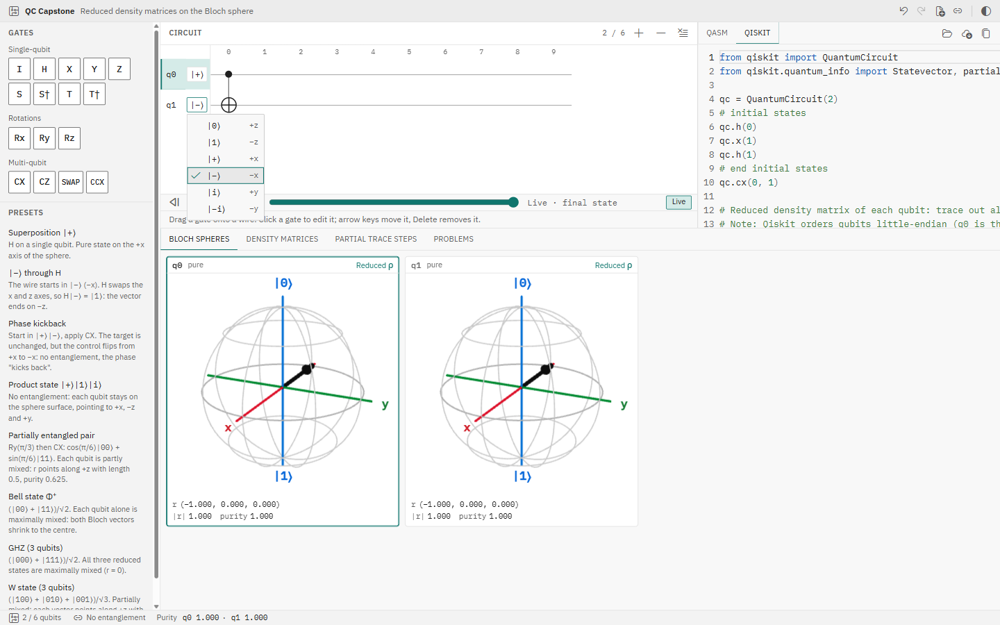
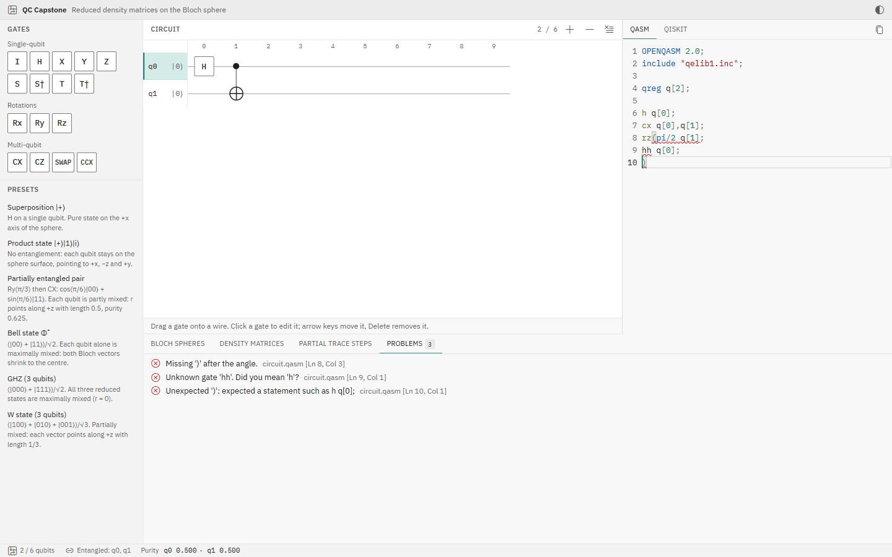

# QC Capstone — Reduced density matrices on the Bloch sphere

A browser tool that takes a multi-qubit quantum circuit, simulates it, isolates each qubit's
reduced density matrix ρₖ by partial tracing, and shows every qubit's (possibly mixed) state on
its own Bloch sphere. A pure, unentangled qubit sits on the sphere surface; a qubit entangled with
the rest is mixed and its Bloch vector shrinks inside the sphere (to the centre for a Bell pair).
The UI is laid out like an IDE: gate palette, circuit canvas, code editor, output panel.



## Features

- **Circuit canvas**: drag gates from the palette onto qubit wires (or click a palette gate to
  append it), move and delete them, edit control/target qubits and rotation angles
  (`pi/2`, `-3*pi/4`, `0.25`), add or remove qubits (1–6).
- **Gate set**: I, H, X, Y, Z, S, S†, T, T†, Rx(θ), Ry(θ), Rz(θ), CX, CZ, SWAP, CCX (Toffoli).
- **Initial states**: click a wire's `|0⟩` label to start it in |0⟩, |1⟩, |+⟩, |−⟩, |i⟩ or |−i⟩.
  Both code tabs show the choice as a marked `initial states` block of preparation gates.
- **Rotation sliders**: Rx/Ry/Rz have a slider next to the angle field (−2π…2π, Shift snaps to
  π/8, the label shows exact π fractions). A whole drag is one undo step. Bloch arrows animate
  between states (off under reduced motion); a zero-length vector shows an "r = 0" marker.
- **Presets**: |+⟩, |−⟩ through H, phase kickback, a product state, a partially entangled pair,
  Bell Φ⁺, GHZ, W.
- **Bloch spheres**: one per qubit, sized to the panel (up to 320 px), with (x, y, z), |r| and
  purity Tr(ρ²). Fixed axis colours x = red, y = green, z = blue.
- **Code panel, both tabs editable**: OpenQASM 2.0 and Qiskit Python, each in two-way sync with
  the canvas and with each other. Editing one tab regenerates the other, never the one you are
  typing in. Python is never executed: a hand-written parser reads a straight-line subset
  (one gate call per line; analysis lines such as `Statevector(qc)` are ignored).
- **Problems tab**: errors and warnings from both tabs with the source tab, file name and exact
  line/column, editor squiggles, click to jump. On an error the last valid circuit is kept.
- **Step-through debugger**: a timeline under the canvas steps through the circuit column by
  column (buttons, slider, play/pause, `[` / `]`). Spheres and the teaching tabs show the state
  after the highlighted column; "Live" returns to the final state, and any edit returns to Live.
- **Density Matrices tab**: reduced ρ, Bloch vector, purity, von Neumann entropy, and the full
  ρ = |ψ⟩⟨ψ| (up to 4 qubits); hovering an entry of the reduced ρ outlines the full-ρ entries
  it is summed from.
- **Keep any subset**: "Keep qubits" chips in both teaching tabs trace out every other qubit and
  show the 2ᵏ×2ᵏ reduced ρ (k ≤ 3), purity, entropy S(ρ) in bits and what was traced out.
- **Partial Trace Steps tab**: the textbook partial trace, step by step, with a check that it
  equals the fast direct method.
- **Files**: open `.qasm`, `.py` or `.txt` files (button or drag and drop); download the circuit
  as `.qasm` or `.py`, and all Bloch spheres as one PNG.
- **Undo/redo, autosave, links**: undo/redo for every circuit change, autosave in the browser,
  New circuit, and Copy link (the whole circuit is encoded in the URL; nothing is uploaded).
- **Status bar**: qubit count, entangled qubits, purity per qubit, debugger step, code errors.
- Light and dark themes (follows the OS until you choose), skeleton loaders only where something
  actually loads, and no network access at runtime.

| Step-through debugger, Bell circuit after H (dark)                                         | Keep two qubits of GHZ (light)                                            |
| ------------------------------------------------------------------------------------------ | ------------------------------------------------------------------------- |
|  |  |

| Density matrices, W state (dark)                                      | Partial trace steps, W state (dark)                                          |
| --------------------------------------------------------------------- | ---------------------------------------------------------------------------- |
|  |  |

| Initial-state picker, phase kickback (light)                                                    | QASM errors in the Problems tab (light)                                           |
| ----------------------------------------------------------------------------------------------- | --------------------------------------------------------------------------------- |
|  |  |

## Keyboard shortcuts

| Keys                                        | Where                                   | Action                                       |
| ------------------------------------------- | --------------------------------------- | -------------------------------------------- |
| Ctrl+Z / Ctrl+Y / Ctrl+Shift+Z (⌘ on macOS) | anywhere outside the editors and inputs | Undo / redo a circuit change                 |
| Ctrl+Z / Ctrl+Y                             | inside a code tab                       | Undo / redo the text (the editor's own undo) |
| `[` / `]`                                   | canvas focused (click it)               | Previous / next step in the debugger         |
| Arrow keys                                  | selected gate                           | Move the gate by one column / wire           |
| Delete or Backspace / Escape                | selected gate                           | Delete it / deselect                         |
| ← → / Shift+arrow, PageUp, PageDown         | angle slider                            | 1° steps / previous or next π/8 mark         |
| Home / End                                  | angle slider                            | −2π / 2π                                     |
| Enter, Space, arrows, Escape                | initial-state picker, menus             | Open, move, choose, close                    |

## File formats and limits

- **`.qasm`**: OpenQASM 2.0 as Qiskit exports it. Supported: one `qreg`, the gate set above,
  `u`/`u1`/`u2`/`u3`/`p`/`sx`/`sxdg` (drawn as rotations, exact up to a global phase), custom
  `gate` definitions (expanded inline, nesting ≤ 16), and final `measure`, `creg`, `barrier`
  (warnings, ignored). OpenQASM 3 is rejected with a clear message.
- **`.py`**: a straight-line Qiskit subset: `qc = QuantumCircuit(n)`, then one gate call per
  line (`qc.h(0)`, `qc.cx(0, 1)`, `qc.rx(pi/2, 0)`, lists like `qc.h([0, 1])`, keyword
  arguments). Loops, functions and other code that would change the circuit are reported as
  errors; analysis code is ignored. Python is never run.
- **`.txt`**: treated as QASM if it has an `OPENQASM` line, otherwise as Qiskit.
- **Limits** (also enforced on links, saved data and the editors): at most 6 qubits, 500 gates,
  column 1000; files ≤ 100 KB; shareable links ≤ 8 KB. Anything over a limit is rejected with a
  message; nothing from outside is executed or rendered as HTML.

## Running locally

Requirements: Node.js 20 or newer (developed on Node 24), npm.

```sh
npm ci
npm run dev            # development server, http://localhost:5173
```

Production build, served locally. Fonts, icons, Monaco, three.js and the Web Workers are all
bundled, so this works with no internet connection:

```sh
npm run build
npm run preview        # http://localhost:4173
```

Checks (the same ones CI runs on every push):

```sh
npm run typecheck
npm run lint
npm run format:check
npm run test
npm run build
```

Deploying: see [docs/DEPLOY.md](docs/DEPLOY.md). The build is a static site with its security
headers generated at build time. The offline build must be **served** (as above, or by any static
web server): opening `dist/index.html` straight from disk (`file://`) does not work, because
browsers block module scripts and Web Workers there.

The app keeps your circuit in the browser's localStorage. If a saved circuit cannot be read, it
is moved to the key `qc-capstone:circuit:v2:discarded` and the app starts with a new circuit.

## Verification against Qiskit

`verify/` runs the same circuits in Qiskit and compares them with this app's engine: fixed
circuits (presets, basis states, Bell and GHZ states, every gate, rotations, Toffoli layouts),
240 seeded random circuits of 1–6 qubits, and 139 circuits with non-|0⟩ start states (519 in
all). For each it compares every single-qubit reduced ρ and, through Qiskit's `partial_trace`,
2965 kept subsets of qubits (reduced ρ, purity and von Neumann entropy). Everything agrees: the
largest difference in any reduced density matrix entry is 2.2 × 10⁻¹⁵ (Qiskit 2.5.2).

```sh
python -m venv verify/.venv
verify/.venv/Scripts/python -m pip install -r verify/requirements.txt   # macOS/Linux: verify/.venv/bin/python
npm run verify
```

See [verify/README.md](verify/README.md) for details, including qubit ordering.

## How it works

**One source of truth.** The circuit is a plain JSON model (`src/model/types.ts`) held in a
zustand store. The canvas, the QASM/Qiskit code and the math are all derived from it. Every
change is tagged with its source (`canvas`, `qasm`, `qiskit`, `preset`, `file`, `url`,
`history`, `restore`): each code tab regenerates its text for every source except its own, so
the text you are typing is never rewritten. Undo/redo stores snapshots of the model; autosave,
links and files all load through one validator (`src/model/validate.ts`).

**Math pipeline** (`src/engine/`, pure TypeScript, runs in a Web Worker):

1. Statevector simulation from the product of the chosen start states (|0…0⟩ by default),
   applying gates column by column. The debugger asks for the state after a given column.
2. For each qubit, the reduced density matrix ρₖ (2×2) by the **direct method**:
   ρₖ[a][b] = Σ ψ(a, rest) · conj(ψ(b, rest)) over the other qubits' basis states. This is O(2ⁿ).
3. Bloch vector r = (2·Re ρ₀₁, −2·Im ρ₀₁, ρ₀₀ − ρ₁₁), length |r|, purity Tr(ρₖ²). A qubit is
   flagged as entangled when |r| < 1.
4. For the teaching tabs, the **explicit method**: build the full ρ = |ψ⟩⟨ψ| (2ⁿ×2ⁿ) and trace
   out the other qubits. This is O(4ⁿ). Both methods are tested to agree to 10⁻¹⁰.
5. For "Keep qubits", the same two methods generalised to any set of kept qubits, plus the von
   Neumann entropy S(ρ) = −Σ λ log₂ λ from the eigenvalues of ρ (Jacobi method).

The worker keeps the UI responsive; stale results are dropped, and a "computing" state appears
only if a result takes longer than 150 ms.

**Qubit ordering.** The engine uses the textbook (big-endian) convention: a basis state reads
|q0 q1 … qₙ₋₁⟩, so q0 is the most significant bit. Qiskit is little-endian (q0 is the least
significant bit); the verification script accounts for this.

**Why at most 6 qubits.** This is a readability choice, not a memory limit: the engine works for
any n. A statevector has 2ⁿ entries, so a browser could handle roughly 25 qubits, but past 6 the
full density matrix (64×64) and the step-by-step trace stop being readable. That exponential
growth is also the reason quantum hardware is interesting at all.

**Why both code tabs can be edited without running Python.** OpenQASM 2.0 is a flat list of
instructions, so it maps to and from the circuit model cleanly. Qiskit Python can contain
arbitrary code (loops, functions), so the app accepts only a straight-line subset, one gate call
per line, which maps to the model exactly like QASM. Anything else is reported, never run.

## Project structure

```
src/
  engine/       statevector simulator, partial trace (direct + explicit), Bloch vector, purity
  worker/       Web Worker wrapper around the engine and the store bridge
  model/        circuit types, zustand stores (circuit, history, debugger step), validation,
                placement helpers, presets, angle parsing
  codegen/      circuit → OpenQASM 2.0, circuit → Qiskit Python (incl. initial-state blocks)
  parser/       OpenQASM 2.0 and Qiskit subset → circuit, with positioned errors
  persistence/  autosave and shareable links
  history/      undo/redo wiring and shortcuts
  files/        open, download, Bloch PNG export
  components/   Sidebar, Canvas, Timeline, CodePanel (Monaco), Bloch, Teaching, BottomPanel,
                StatusBar, TitleBar, Notices
  styles/       design tokens (light/dark CSS variables) and global styles
tests/          Vitest tests (2000+) for the engine, parsers, codegen, sync, persistence, files,
                canvas and UI panels, including hostile-input tests
verify/         Python + Qiskit cross-check of the engine
docs/           screenshots, the demo script (DEMO.md), the v2 review
```

A scripted demo with fallbacks is in [docs/DEMO.md](docs/DEMO.md).

## Tech stack

Vite, React, TypeScript, zustand, @dnd-kit, Monaco editor, three.js with react-three-fiber and
drei, react-resizable-panels, IBM Plex Sans/Mono and VS Code codicons (bundled), Vitest,
ESLint, Prettier. Verification: Python, Qiskit, NumPy.
